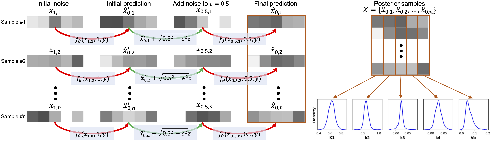
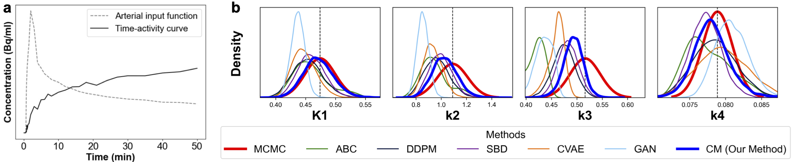

# PET-TRACER
PET-TRACER (PET **T**otal-body Paramet**R**ic **A**nalysis via **C**onsistency **E**stimation for **R**adiotracers) 
#### Yun Zhao (The University of Sydney, Australia), Steven Meikle (The University of Sydney, Australia), Andrew Reader (King's College London, UK), Yanan Fan (CSIRO's Data61, Australia)

Contact Email: yun.zhao@sydney.edu.au, steven.meikle@sydney.edu.au

**PET-TRACER** was used in the below paper
1. *Generative Consistency Models for Estimation of Kinetic Parametric Image Posteriors in Total-Body PET [Submitted to IEEE Transactions on Medical Imaging](https://arxiv.org/abs/2509.13614)*

<p align="center">
  
</p>

PET-TRACER is an open-source Python framework designed to bring state-of-the-art Bayesian kinetic parameter estimation to dynamic total-body positron emission tomography (PET) imaging. At its core, PET-TRACER implements a novel generative consistency model (CM) pipeline that accelerates posterior inference of two-tissue compartment parameters—namely $K_1, k_2, k_3, k_4$, and blood volume fraction $V_b$—from time–activity curves (TACs) and arterial input functions (AIFs). By collapsing what traditionally requires hundreds of denoising steps into just three highly optimized U-Net passes, PET-TRACER enables rapid, high-fidelity sampling of per-voxel kinetic posteriors, paving the way for truly quantitative, uncertainty-aware parametric imaging at whole-body scale.

## Highlights
1. Processes total body PET containing tens of millions of voxels in **90 minutes**.
2. Outperforms traditional diffusion models (DDPM, score-based diffusion) by **at least 100×** and is **3×** faster than GPU-based parallel ABC (Approximate Bayesian Computation).
3. Matches full MCMC-based inference quality, while reducing uncertainty estimation error by **at least 10%** compared to ABC when MCMC posteriors are treated as ground truth.

## Installation

### 1. Create a New Python Environment
A dedicated configuration file, `environment_no_builds.yml`, is provided specifically for Windows users.

1. Open your **Anaconda PowerShell Prompt**.
2. Navigate to the directory containing the `.yml` file.
3. Run the following command to create the environment (this installs Python 3.11.14):

```bash
conda env create -f environment_no_builds.yml
```

If the above fails, in **Anaconda PowerShell Prompt** create a Python 3.11.14 environment and install the dependencies manually:

```bash
conda create -n <env_name> python=3.11.14
conda activate <env_name>
conda install pandas matplotlib seaborn tqdm scipy pytables
```

### 2. Install NVIDIA GPU Dependencies
Once the environment is created, you need to install the necessary PyTorch binaries for GPU support.

1. Open Anaconda Navigator.
2. Click on Environments in the left sidebar and select the environment you just created.
3. Click the green play button next to the environment name and select Open Terminal.
4. Run the command below to install PyTorch with CUDA support:

```bash
pip install --pre torch torchvision torchaudio --index-url https://download.pytorch.org/whl/nightly/cu128
```
⚠️ Note on CUDA version: cu128 is compatible with RTX 30, 40 and 50 series. You may need to find the CUDA version for your GPUs.

### 3. Verification & Testing
To ensure everything is configured correctly: 
1. In Anaconda Navigator, activate the environment created in Step 1.
2. Launch Jupyter Notebook and navigate to the PET-TRACER folder.
3. Open the notebook named Total_body_parametric_imaging_demo.ipynb.
4. Run the first code block. If it prints "cuda:0", your PyTorch, NVIDIA GPUs, PET-TRACER are configured successfully.

⚠️ Note on Batch Size: In code block 3, please adjust the batch_size according to your GPU memory:

8GB VRAM: batch_size=100 is recommended.

80GB VRAM: You can scale batch_size up to 1,000.

## Getting Started
Two examples are provided to show the usage of **PET-TRACER**.
   
1. Single_TAC_demo.ipynb demonstrates posterior estimation from single TAC and AIF pair.
2. Total_body_parametric_imaging_demo.ipynb demonstrates generating parametric imaging of $K_i$ from total body dynamic PET.

## Adaptation to your data
The consistency model in PET-TRACER was trained and validated on dynamic PET curves discretized into 35 frames, as shown below. Because the posterior inference network expects input TACs and AIFs sampled at these exact time points, you should resample your real dynamic PET data to this same 35-frame schedule before running inference. Likewise, if you’re generating synthetic data for training or testing, be sure to simulate both the tissue time–activity curve and arterial input function at these 35 time points. This alignment ensures that the model’s learned temporal features correctly match your input, enabling accurate, uncertainty-aware kinetic parameter estimation.

| Frame Duration (Min) | Mid Time Point (Min) |
| :------------------- | :------------------- |
| 0.0833               | 0.0417               |
| 0.0833               | 0.1250               |
| 0.0833               | 0.2083               |
| 0.0833               | 0.2917               |
| 0.0833               | 0.3750               |
| 0.0833               | 0.4583               |
| 0.0833               | 0.5417               |
| 0.0833               | 0.6250               |
| 0.0833               | 0.7083               |
| 0.0833               | 0.7917               |
| 0.0833               | 0.8750               |
| 0.0833               | 0.9583               |
| 0.2500               | 1.1250               |
| 0.2500               | 1.3750               |
| 0.2500               | 1.6250               |
| 0.2500               | 1.8750               |
| 1.0000               | 2.5000               |
| 1.0000               | 3.5000               |
| 1.0000               | 4.5000               |
| 1.0000               | 5.5000               |
| 1.0000               | 6.5000               |
| 1.0000               | 7.5000               |
| 2.0000               | 9.0000               |
| 2.0000               | 11.0000              |
| 2.0000               | 13.0000              |
| 2.0000               | 15.0000              |
| 2.0000               | 17.0000              |
| 3.0000               | 19.5000              |
| 3.0000               | 22.5000              |
| 3.0000               | 25.5000              |
| 3.0000               | 28.5000              |
| 5.0000               | 32.5000              |
| 5.0000               | 37.5000              |
| 5.0000               | 42.5000              |
| 5.0000               | 47.5000              |

## Methods
The **consistency model** at the heart of PET-TRACER is a conditional generative framework that learns to map noisy, partially diffused kinetic parameter estimates back to their true posterior distributions in just a handful of passes. Built on a lightweight 1D U-Net architecture, the model is trained to denoise and “roll back” samples through a learned consistency function, rather than simulating every diffusion timestep. During training, the network sees paired noisy and clean two-tissue compartment parameter curves $K_1, k_2, k_3, k_4, V_b$ alongside their corresponding TAC + AIF inputs and learns to enforce consistency between successive denoising steps. The result is a model that captures the underlying posterior geometry with high fidelity, learning to produce accurate, uncertainty-aware parameter samples from arbitrary starting noise levels.

The **multistep consistency sampling algorithm** then leverages this trained model for fast posterior draws. First, a random Gaussian vector $x_T$ is sampled at the highest noise scale $T$ and is fed to the U-Net with TAC + AIF pair and noise level $T$. The U-net produces an initial coarse estimate. Next, one steps through a strictly decreasing sequence of intermediate noise levels $t_1>t_2>\dots> t_{N-1}$. At each step $n$, fresh Gaussian noise is injected to corrupt the denoised sample back to noise level $n$ and the U-Net refines it back to noise free sample $x_0$. After processing all $N-1$ levels, the final $x_0$ is returned as a sample from the posterior. By repeating the sampling many times, one can get a bunch of posterior samples. The multistep sampling algorithm is illustrated in the figure below.



The figure below shows an example of posterior estimation with one TAC-AIF pair predicted by CM, MCMC, and other baselines.


## Support and Help
Please raise your queries via the "Issues" tab or contact me (yun.zhao@sydney.edu.au).
