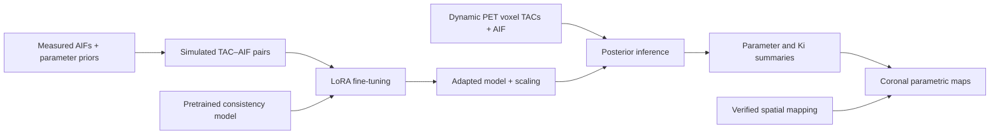

# PET-TRACER

### Bayesian kinetic modelling for dynamic total-body PET

PET-TRACER (**PET** **T**otal-body Paramet**R**ic **A**nalysis via **C**onsistency **E**stimation for **R**adiotracers) uses generative consistency models for rapid posterior estimation from tissue time–activity curves (TACs) and input functions.

**LoRACM** extends PET-TRACER with low-rank adaptation of a pretrained consistency model. This release focuses on **Scenario 1: adapting FDG two-tissue compartment modelling from the Siemens Biograph Vision Quadra protocol to the UC Davis uEXPLORER protocol**.

[Start the LoRACM tutorial](LoRACM/README.md) · [Data formats](LoRACM/docs/DATA_FORMATS.md) · [Original framework](docs/legacy-framework.md) · [Release review](LoRACM/docs/RELEASE_REVIEW.md)

> **Release candidate.** The Scenario 1 workflow is organised for review. Timing and spatial metadata checks described in the release review must be resolved before an exact-reproduction release is advertised.

## Choose your workflow

| I want to… | Start here |
| :--- | :--- |
| Explore the original pretrained model on one TAC | [Single TAC demo](Single_TAC_Demo.ipynb) |
| Use the original total-body imaging demo | [Total-body demo](Total_Body_Parametric_Imaging_Demo.ipynb) |
| Create an adaptation dataset and fine-tune LoRACM | [Scenario 1 tutorial](LoRACM/README.md) |
| Predict voxel posteriors and display a coronal slice | [Inference and mapping](LoRACM/README.md#3-predict-voxel-posteriors) |
| Adapt to my own measured input functions | [Custom data guide](LoRACM/docs/CUSTOM_DATA.md) |

## From input functions to parametric maps


```mermaid
flowchart LR
    A[Measured AIFs + parameter priors] --> B[Simulated TAC–AIF pairs]
    B --> C[LoRA fine-tuning]
    P[Pretrained consistency model] --> C
    C --> D[Adapted model + scaling]
    R[Dynamic PET voxel TACs + AIF] --> E[Posterior inference]
    D --> E
    E --> F[Parameter and Ki summaries]
    F --> G[Coronal parametric maps]
    M[Verified spatial mapping] --> G
```

The demo estimates **K₁, k₂, k₃, k₄ and Vᵦ**, and derives **Kᵢ** from joint posterior draws. It provides a single coronal slice spanning the body; it does not distribute a complete 3D patient volume. The new manuscript also studies SRTM and AATH adaptation; those scenarios are outside this demo release.

## Repository layout

```text
PET-TRACER/
├── README.md                              # Project entry point
├── Source/                                # Original framework (preserved)
├── Pretrained/                            # Original model assets (preserved)
├── Sample_data/                           # Original examples (preserved)
├── Single_TAC_Demo.ipynb                   # Original demo (preserved)
├── Total_Body_Parametric_Imaging_Demo.ipynb # Original demo (preserved)
├── Assets/                                # Existing figures (preserved)
├── docs/legacy-framework.md                # Archived original README
└── LoRACM/                                # Adaptation workflow
    ├── configs/                           # Manuscript settings and smoke test
    ├── create_dataset.py                  # Measured AIF → simulated pairs
    ├── train.py                           # Foundation → adapted checkpoint
    ├── infer.py                           # TACs → posterior summaries
    ├── notebooks/                         # Parametric imaging viewer
    ├── data/                              # AIFs, simulation pairs, real slice
    ├── checkpoints/                       # Foundation weights
    ├── docs/                              # Formats, provenance, release notes
    └── tests/                             # Interface and mapping checks
```

## Research

- **Original framework:** *Generative Consistency Models for Estimation of Kinetic Parametric Image Posteriors in Total-Body PET*. [Preprint](https://arxiv.org/abs/2509.13614). The supplied new manuscript cites this work as IEEE Transactions on Medical Imaging, 2026; final publication metadata should be added before release.
- **LoRACM extension:** *A General-Purpose Adaptable Foundation Model for Total-Body PET Kinetic Modelling*. Manuscript in preparation for submission to IEEE Transactions on Medical Imaging. Citation metadata will be added when available.

When using LoRACM, please cite both the original framework and the adaptation paper once its public reference is available. Model performance and runtime statements belong to their reported experiments; the smoke test is an installation check.

## Support and licensing

For questions, open a GitHub issue or contact Yun Zhao at **yun.zhao@sydney.edu.au**. The existing [MIT licence](LICENSE) covers the software. Dataset and model redistribution terms are recorded separately in [data provenance](LoRACM/docs/DATA_PROVENANCE.md); a software licence does not establish permission to redistribute clinical data.
